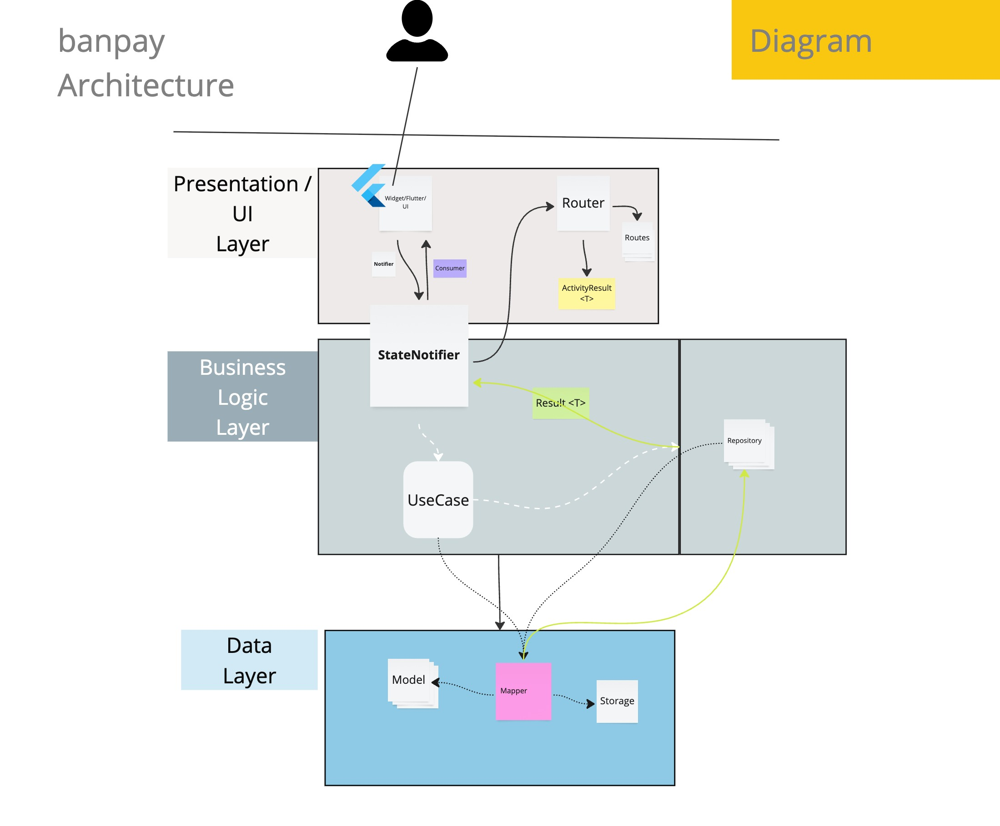

# 🚀 Banpay

**Challenge Mobile Lead**

**by César Ortega**

---

## 🛠️ Getting Started

Before running the app for the first time, make sure to run:

```bash
make generate_all
```
if you see the question
```
Delete these files?
1 - Delete
2 - Cancel build
3 - List conflicts
```

Choose the option 1 to delete the files and generate the new ones.

---

# Architecture


---
